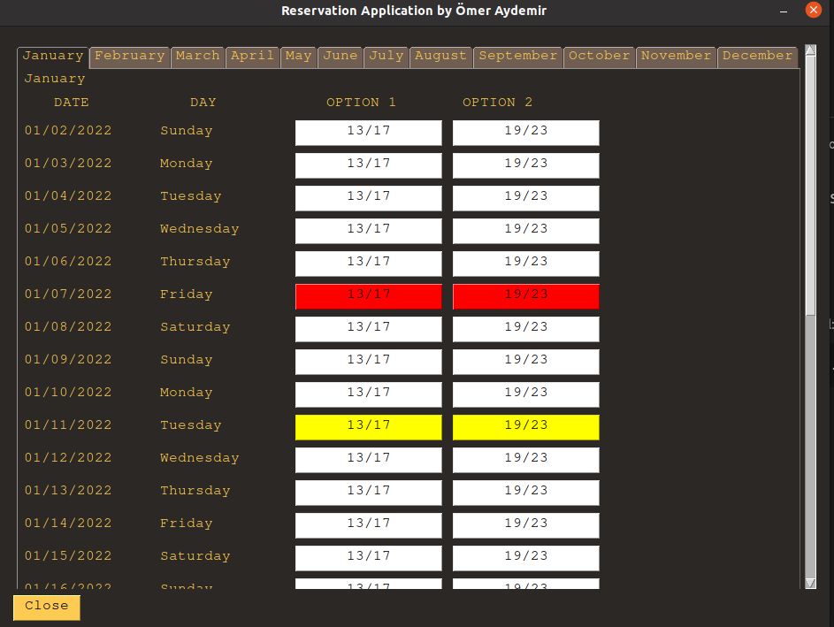
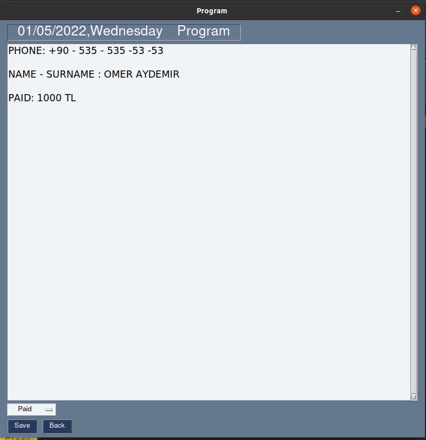

# Contents
* [About](#about)
* [Installation](#installation)
* [Tools and Technologies](#tools-and-technologies)
* [Main Features](#main-features)


# About

This sample desktop application, built on PySimpleGUI, is for managing reservation system which connected MySql database. It allows you to save,update or delete reservations.

## Libraries and Technologies

* PySimpleGUI
* Pandas
* MySql

## Installation

Use the package manager [pip](https://docs.docker.com/engine/install) to install:

```bash
pip install -r requirements.txt
```

## Main Features


### General View

The color is yellow if reserved,it's red if its paid.



### Create Reservation 




## License
[GNU 3.0](https://github.com/omeraydemirr/tour-api/blob/c2638bb33e018fab441d078f2a95d4baab905b64/LICENSE)
